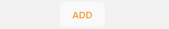
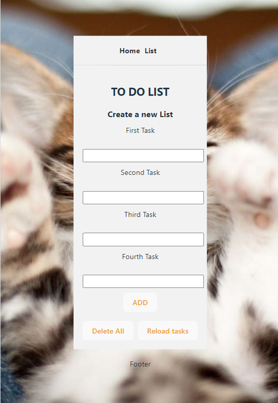

# React-ToDoList

Hola a tod@s!

Os voy a ir contando paso a paso la funcionalidad de este ejercicio realizado con React!

Teneis 2 opciones para poder visualizar el ejercicio:

1. La mas sencilla es que puedas ver la funcionalidad del proyecto a través del siguiente enlace el cual te llevará al despliegue que realice en Netlify y puedas navegar directamente sin necesidad de instalar nada:

https://main--funny-blini-f3366e.netlify.app/

2. Si deseas clonarte el repositorio y realizar tu mism@ pruebas e instalartelo en tu ordenador, puedes seguir los siguientes pasos:

Para iniciar el proyecto una vez hayais clonado el repositorio (en caso de que querais probarlo) debereis instalar las dependencias, utilizar el siguiente comando en vuestra terminal:

npm run install
De esta forma os instalara todo lo necesario para que el proyecto pueda iniciarse!

a continuacion utilizar el siguiente comando para arrancar el proyecto:

npm run dev
Ahora podreis navegar por el siguiente puerto establecido en vuestro local:

http://localhost:5173/

FUNCIONALIDAD DEL EJERCICIO:

El proyecto tiene 2 vistas la primera simplemente es un input de texto para que puedas introducir un campo y veras que se escribe justo debajo mostrando el resultado, el boton de ADD no tiene funcionalidad, estaba simplemente probando :P

La segunda vista es donde se pone un poco más interesante (esperemos)

Es un To Do List el cual muestra por defecto varias tareas diferentes debajo y justo encima hay unos botones completamente funcionales para que puedas manejar los estados como quieras:

- Borrar una lista
- Borrar todas
- Refrescar las listas

Más arriba de la misma vista te encontraras con un formulario de 4 campos en el cual puedes añadir tareas! NO HACE FALTA QUE RELLENES TODOS, SI QUIERES SOLO PUEDES AÑADIR UNA :D

Cuando hayas añadido una tarea pulsa en el boton de ADD:

Veras que la tarea o tareas se añade al final de la vista.

Si refrescas la pagina volveran a mostrarse las tareas que puse por defecto.

Para la realizacion del proyecto he utilizado React Hook: UseState.

Imagen de la vista de tareas:

PD: Hay un gatito de fondo, SI, todo es mejor con un gatito alrededor!